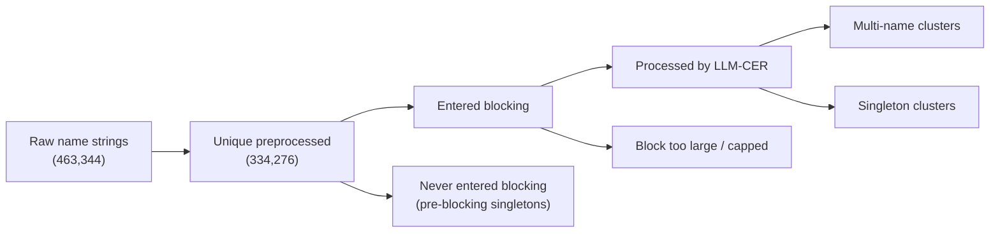

# NLRB Entity Resolution — Evaluation Plan & Next Steps

*A practical roadmap for evaluating, comparing, and validating the fuzzy-matching and LLM-clustering pipelines used to resolve company names in NLRB R-Case / C-Case data.*

---

## Background: the conclusions we reached

A few ideas frame everything below. They are the conclusions of the discussion, and every step serves one of them.

**There are two different tasks, and they need two different evaluations.**

1. **The matching task** — linking an R Case to a C Case (same firm, same place, overlapping time). This is a *bipartite record-linkage* problem. Your existing 250-pair blinded audit measures it.
2. **The clustering task** — resolving all ~334k company-name strings into firm-level entities. This is a *deduplication / clustering* problem, and it is the thing your IC2S2 abstract actually promises ("firm-level aggregation").

The matching task is a **downstream application** of the clustering and only a *biased keyhole* onto it: it only ever tests clusters that happen to contain both an R-side and a C-side name in the same city and time window. "The matching looks good" is necessary but **not sufficient** evidence that "the clustering is good enough to aggregate firms."

**Use the two name-matching methods together, not as rivals.** Your own failure analysis shows they fail on *structurally different* populations — LLM clustering catches semantic equivalences (DBAs, abbreviations, parent/subsidiary, brand variants) but misses character-level typos in short, neighbor-less names; high-score fuzzy catches exactly those typos. The defensible operational policy is a **tiered hybrid**: clustering as the backbone, high-threshold fuzzy (`token_sort_ratio ≥ 90`) as an additive typo-recovery layer, with **provenance flags** on every accepted link so substantive results can be re-run on nested "core / core+fuzzy / full" samples.

**Recall is intractable for the matching task but tractable for the clustering task.** You cannot sample the ~100M non-matched R×C pairs to find missed links. But you *can* estimate clustering recall by sampling whole entities and reconstructing their true membership locally — which dissolves the recall problem for the question that matters for firm aggregation.

**The LLM clustering lacks a confidence/agreement score (unlike the fuzzy score).** You can manufacture one with **consensus / stability**: re-run the clustering several times with permuted record orderings and record how often each name pair lands together.

**Frame the whole exercise as auditing a data-construction process, not benchmarking an algorithm.** For an IC2S2 / sociology audience the contribution is not "our clustering scores *X* on a benchmark," but "here is a principled audit of how reliably we turned messy NLRB names into firm entities, and what that reliability implies for firm-level inference." That register also dictates the emphasis below: error *severity* and downstream distortion matter more than aggregate accuracy — which is why the next section comes before the steps.

---

## Error severity: why over-merges dominate (read this before the steps)

Not all clustering errors cost the same, and for firm-level aggregation in NLRB research the asymmetry is large and one-directional. A **catastrophic over-merge** — two genuinely different firms bridged into one cluster or one canonical key — corrupts *every* downstream firm-level quantity (strike histories, ULP rates, union win rates, firm trajectories), because counts and rates get pooled across unrelated establishments. A **missed typo alias**, by contrast, leaves a firm slightly fragmented but rarely distorts an aggregate. The evaluation must be read through this asymmetry rather than treating all errors as interchangeable.

| Error type | Layer where it occurs | Downstream damage |
|---|---|---|
| Cross-company bridge merge (two real firms joined) | clustering | **Catastrophic** — pools unrelated firms' histories |
| Giant over-merge (many names wrongly fused) | clustering | **Catastrophic** — damage scales with cluster size |
| Representative collision (distinct firms share a canonical key) | matching / aggregation | **Catastrophic** — silent firm-key contamination |
| Unresolved singleton (true variant left alone) | blocker / clustering | Moderate — under-counts a firm's activity |
| Over-split (one firm into a few subclusters) | clustering | Often tolerable — fragments, rarely pools wrongly |
| Missed typo alias | blocker / fuzzy | Small — minor fragmentation |

What this asymmetry justifies, and how to operationalize it:

- It justifies prioritizing **precision / over-merge auditing** (Step 3's similarity tail and representative check; Step 4's B-cubed precision) over chasing the last points of typo recall.
- It explains why **pairwise precision alone is insufficient**: a single bridge merge between two large clusters generates an enormous number of false pairs, so pairwise precision can crater on exactly the catastrophic case — read it together with B-cubed (record-centric) and with the *size* of the clusters involved.
- It clarifies the division of labor: the **severe** failures live on the precision side (over-merges), while **blocker completeness** governs the more-tolerable recall failures.
- **Operationalize it:** weight every precision error by the size of the cluster it occurs in (or by the number of downstream R/C records that inherit the merged firm key), and report a *size-weighted* error rate alongside the unweighted one. Actively hunt for **cross-company bridge merges**: in the Step 4 sample and the Step 3 similarity tail, flag any cluster whose members split into two or more internally-coherent name groups with little cross-group similarity — that split pattern is the signature of a bridge.

Use this as the lens for every metric below: where a choice trades recall for precision on large clusters, prefer precision.

---

## How the six steps fit together

| # | Step | Primarily checks | Effort | Depends on |
|---|------|------------------|--------|------------|
| 1 | Coverage accounting (name data-flow) | Foundation for clustering claim | ½ day | — (independent) |
| 2 | Re-weight existing matching precision | Matching (linkage) | ½ day | Existing labeled sample |
| 3 | Label-free full-file diagnostics | Clustering + blocker | 1–2 days | Mostly independent (improves with Step 4) |
| 4 | Entity-centric clustering benchmark | Clustering | 1–2 weeks | Step 1 (sampling frame) |
| 5 | Matching-recall estimation | Matching (linkage) | days | Step 2 (corrected counts) |
| 6 | *(optional)* Consensus / stability confidence | Clustering + comparison | compute-heavy | Independent (feeds 2, 4) |

Steps 1–3 are quick wins that upgrade the current draft. Step 4 is the main new labeling effort and the highest-value addition for the firm-aggregation claim. Step 5 addresses matching recall (with conditional recall as the primary figure). Step 6 is an *optional* extension that supplies the missing confidence score if the compute budget allows.

---

## Step 1 — Coverage accounting (the name data-flow)

**Main idea & motivation.** Before any metric, produce a single transparent figure that tracks how many company names exist at each pipeline stage: raw strings → unique preprocessed names → names that entered blocking → names processed by the LLM → names emitted as singletons/fallbacks → names that never reached clustering at all. Your materials currently show several different totals (e.g. 463,344 raw → 334,276 unique preprocessed → 224,767 in the evaluated cluster file across 91,120 clusters, with 38,892 singletons). Until these reconcile, any firm-aggregation claim looks shaky, because readers can't tell how many firms were never even candidates for resolution.

**Practical guidelines.** Count at each stage from the source files and draw the flow as a diagram.

```python
import pandas as pd

ca = pd.read_csv("cluster_assignments_20260517.csv")
print("rows in cluster file        :", len(ca))
print("unique global clusters      :", ca["global_cluster_id"].nunique())
print("singleton clusters          :", (ca["cluster_size"] == 1).sum())
print("names in multi-name clusters:", (ca["cluster_size"] > 1).sum())
# Reconcile against: raw string count, unique-preprocessed count,
# and the count of names that never entered blocking (absent from this file).
```



**What it evaluates & NLRB contribution.** Foundational for the **clustering** claim. It defines the universe over which any firm-level statistic is computed and exposes the population of names that can *never* be aggregated (pre-blocking singletons), which is a real limit on firm-level coverage in the NLRB panel.

**Dependencies.** Independent. Prerequisite for interpreting Steps 3–5 and for defining the Step 4 sampling frame.

**Sources.** Project materials (`clustering_results_table.md`, `clustering_failure_analysis.md`, IC2S2 abstract). General ER pipeline framing: Christen (2012); Papadakis et al. (2021).

---

## Step 2 — Re-weight the existing matching precision

**Main idea & motivation.** You already have a clean, blinded, stratified precision audit of accepted R↔C links (250 pairs across *agreement*, *fuzzy-only*, *cluster-only* cells). But the three cells were sampled at very different rates relative to their true pool sizes, so you cannot simply average the per-cell numbers into an overall precision. Re-weight each cell by its real pool size to get an honest aggregate, and decide a rule for `unclear` labels (report best/worst-case).

**Practical guidelines.** Per-cell binomial precision with Wilson intervals is the right tool here (you sampled pairs roughly uniformly within cells) — keep what `analyze_evaluation_results.ipynb` already does, then add a pool-weighted aggregate.

```python
# Per-cell precision p_cell already computed (match / (match + no_match)).
# True pool sizes (accepted pairs in each cell), including the trivial
# identical-name agreement pool that the sample deliberately excluded:
pools = {
    "agreement_trivial":  39_738,   # identical preprocessed names -> ~1.0 by construction
    "agreement_nontrivial": 9_688,
    "fuzzy_only":           1_046,
    "cluster_only":        11_305,
}
p_cell = {"agreement_trivial": 1.00, "agreement_nontrivial": 1.00,
          "fuzzy_only": 0.959, "cluster_only": 1.00}

def overall_precision(cells):
    num = sum(pools[c] * p_cell[c] for c in cells)
    den = sum(pools[c] for c in cells)
    return num / den

# A method's overall precision = weighted avg over the cells it participates in
fuzzy_cells   = ["agreement_trivial", "agreement_nontrivial", "fuzzy_only"]
cluster_cells = ["agreement_trivial", "agreement_nontrivial", "cluster_only"]
print("Fuzzy overall precision  :", round(overall_precision(fuzzy_cells), 4))
print("Cluster overall precision:", round(overall_precision(cluster_cells), 4))
```

For `unclear`: report the headline excluding unclears from the denominator, plus a sensitivity row treating all unclears first as `match` then as `no_match`.

**What it evaluates & NLRB contribution.** Evaluates **matching (entity linkage)** precision — the false-positive rate of the R↔C links you will actually analyze. Directly underwrites the validity of any establishment-level R↔C result in the paper.

**Dependencies.** Uses the existing labeled sample only; independent of Steps 1, 3–6.

**Sources.** Wilson interval: Wilson (1927); Brown, Cai & DasGupta (2001). Avoiding trivial-positive inflation and metric-ranking caution: Hand & Christen (2018); Menestrina et al. (2010).

---

## Step 3 — Label-free, full-file diagnostics

**Main idea & motivation.** Cheap automated checks you can run over the *entire* cluster file with no new labels. They surface suspicious clusters for targeted review and — crucially — separate **blocker** failures from **LLM** failures. Your failure analysis already shows ~67% of cluster misses are upstream of the LLM (cross-block + pre-blocking singletons), so the most decision-relevant single number is **blocker pair-completeness**: of true same-firm name pairs, what fraction ever shared a block? If that ceiling is low, prompt tuning cannot fix recall.

**Practical guidelines.**

*Blocker pair-completeness* (uses your existing labeled true-match pairs; even better once Step 4 labels exist):
```python
# For each adjudicated true same-firm pair (name_a, name_b),
# did they ever co-occur in a block?
blocks = ca.groupby("company_name")["block_id"].apply(set).to_dict()
def shared_block(a, b):
    return len(blocks.get(a, set()) & blocks.get(b, set())) > 0
completeness = sum(shared_block(a, b) for a, b in true_pairs) / len(true_pairs)
print(f"Blocker pair-completeness: {completeness:.1%}")
```

*Within-cluster string-similarity tail* (over-merge suspects):
```python
from rapidfuzz import fuzz
from itertools import combinations
def min_internal_sim(names):
    if len(names) < 2: return 1.0
    return min(fuzz.token_sort_ratio(a, b) for a, b in combinations(names, 2))
multi = ca[ca.cluster_size > 1].groupby("global_cluster_id")["company_name"].apply(list)
sims = multi.apply(min_internal_sim).sort_values()   # hand-review the low tail
```

*Singleton audit* (recall leak, modes B/C): sample singletons, fuzzy-match `≥ 95` against the rest of the file, and check whether each has an obvious twin that was wrongly left unmerged.

*Representative collision — **flag as a critical structural risk**, not a routine check (see the severity table).* The cluster-matching pipeline substitutes the **shortest** name in each cluster as its canonical key. Short names are the most generic and collision-prone ("ABC Inc."), so this policy systematically selects the worst possible representative. The damage is precise about *where* it bites: a collision does **not** re-cluster the file — the two clusters stay distinct in `cluster_assignments` — but because `match_r_to_c_cases.py` matches on the substituted representative, two different firms whose clusters share a representative string get **silently linked downstream**, and any firm-level aggregation keyed on the representative pools them. *Audit:* flag every representative shared across clusters with very different member sets. *Fix:* replace shortest-name with **most-frequent** or **longest non-abbreviated** name, and enforce representative uniqueness (split or disambiguate on collision). This is distinct from an LLM semantic-bridge over-merge (caught by the similarity tail above); both are catastrophic per the severity table, but they occur at different layers — clustering vs. aggregation — and need different fixes.

**What it evaluates & NLRB contribution.** Evaluates the **clustering** (over-merging via the similarity tail; under-merging / recall ceiling via blocker completeness and the singleton audit) plus the **aggregation-layer** representative-collision risk. Tells you *where to invest* (blocker vs. prompt vs. fuzzy bolt-on vs. representative policy) — the most actionable diagnostic for making the firm key trustworthy.

**Dependencies.** Mostly independent. Blocker pair-completeness uses existing labeled positives now and improves once Step 4 produces a larger labeled set.

**Sources.** Blocking / pair-completeness: Papadakis et al. (2020); Christen (2012). Error-degree / structural over-merge detection: Nanayakkara, Christen & Christen (2025). Internal indices (silhouette etc.) are **secondary debugging only**, not headline evidence.

---

## Step 4 — Entity-centric clustering benchmark *(the main clustering validation)*

**Main idea & motivation.** This is the principled way to get **precision and recall (and F1) for the clustering itself**, with confidence intervals, when there are hundreds of thousands of names and you cannot sample non-matches. The key move (Binette et al.) is to **sample whole entities, not pairs**: draw a probability sample of names, reconstruct each one's *true firm* by hand, and use design-based estimators. This is exactly the PatentsView inventor-disambiguation setup, applied to your firm names.

**Practical guidelines.**

1. **Sample names uniformly at random from the *full* preprocessed name space** — including the pre-blocking singletons absent from the cluster file. Uniform name sampling = sampling clusters with probability **proportional to size**, which is the efficient design *and* the mitigation for heavy-tailed cluster sizes (a few huge firms, a long singleton tail). Target **~400–500 names** (tight intervals at this size per Binette's simulation).
2. **Reconstruct the true firm for each sampled name (blinded).** Start from the predicted cluster, **remove** wrongly included names (→ precision side), then **search the entire name universe** — across blocks and the dropped-singleton pool — for variants that *should* be included (→ recall side). *Confining the search to the name's own block would bake the blocker's failures into your ground truth and overstate recall by exactly the 67% upstream-miss share.*
3. **Estimate metrics with design-based estimators.** Pairwise precision via `P_cluster_block`, pairwise recall via `R_record` (which coincides with `R_cluster_block` under proportional-to-size sampling), each with the first-order **bias adjustment** and **Taylor-approximation confidence intervals**. The *same* sample also yields **B-cubed** precision/recall and **cluster-level** metrics — these are additional ratio estimators off one labeled sample, not a second study. Report pairwise *and* B-cubed (they can rank methods differently; B-cubed exposes over-merging that pairwise can mask).

```python
# Illustrative — confirm exact API at er-evaluation.readthedocs.io
import pandas as pd
from er_evaluation import (pairwise_precision_estimator,
                           pairwise_recall_estimator,
                           b_cubed_precision_estimator,
                           b_cubed_recall_estimator)

# prediction: a "membership" series  name -> predicted cluster id
prediction = pd.read_csv("cluster_assignments_20260517.csv") \
               .set_index("company_name")["global_cluster_id"]

# reference: the hand-resolved TRUE clusters for the sampled names
#   name -> true firm id   (built from the blinded labeling sheet)
reference = pd.read_csv("clustering_benchmark_labels.csv") \
              .set_index("company_name")["true_firm_id"]

# sampling weights handled by the package for proportional-to-size design
P, P_se = pairwise_precision_estimator(prediction, reference)
R, R_se = pairwise_recall_estimator(prediction, reference)
print(f"pairwise precision {P:.3f} ± {1.96*P_se:.3f}")
print(f"pairwise recall    {R:.3f} ± {1.96*R_se:.3f}")
```

**What it evaluates & NLRB contribution.** Evaluates the **clustering** directly and is the single most defensible thing you can add for the firm-aggregation claim. "We follow Binette et al.'s entity-centric estimation framework" is a clean methods sentence and gives reviewers whole-dataset performance with quantified uncertainty.

**Dependencies.** Depends conceptually on **Step 1** (the sampling frame must be the full name space, including dropped singletons). Otherwise self-contained. Reuses your blinded-labeling workflow.

**Sources.** Binette et al. (2023, *The American Statistician*) — cluster/block estimators for precision *and* recall on huge name datasets; Binette et al. (2024, arXiv:2404.05622) — entity-centric framework (pairwise / B-cubed / cluster metrics, root-cause analysis); `ER-Evaluation` Python package; B-cubed: Bagga & Baldwin (1998), Amigó et al. (2009); pairwise vs. cluster F1 / GMD: Menestrina et al. (2010).

---

## Step 5 — Matching-recall estimation

**Main idea & motivation.** Global recall of the R↔C linkage is not estimable (you can't enumerate all true links), and you should not claim it. The honest *primary* target is **conditional recall within a reviewable plausible-candidate pool**. A **capture–recapture** calculation — using your two methods as two imperfect detectors of the same truth — can be reported alongside it, but only as a **heuristic upper-bound triangulation**, never as an estimate of true recall: the two methods are positively dependent (both succeed on "easy" near-identical names, both lean indirectly on lexical similarity), which shrinks the overlap-based denominator and **overstates** recall. Foreground the conditional-recall audit; use capture–recapture only to bracket it from above.

**Practical guidelines.**

*Conditional-recall audit (primary).* Define a reviewable plausible-candidate pool — same state, fuzzy-same city, overlapping window, plus lexical or block proximity — and draw a **biased** sample from pairs in that pool that *neither* method linked, oversampling likely-miss regions (near-threshold fuzzy pairs, top embedding neighbors that landed in different blocks, fallback / non-clustered names). Hand-label, then estimate recall with **design weights** that account for the biased sampling (the PatentsView sampling-bias estimators apply directly). This denominator is reviewable and substantively relevant to establishment linkage, and it is the recall figure you should foreground. Do **not** claim a true overall recall for the whole NLRB universe.

*Capture–recapture (heuristic upper bound only — report as triangulation, not as an estimate).* Using the two methods as two detectors, with **precision-corrected** match counts:
```python
# True matches found by each method, on the NON-TRIVIAL subset
a = 9_688 * 1.00        # agreement (non-trivial), both methods
b = 1_046 * 0.959       # fuzzy-only true matches
c = 11_305 * 1.00       # cluster-only true matches
n_fuzzy, n_cluster = a + b, a + c
N_hat = n_fuzzy * n_cluster / a               # Lincoln–Petersen
print("recall fuzzy   :", round(n_fuzzy / N_hat, 3))
print("recall cluster :", round(n_cluster / N_hat, 3))
print("recall union   :", round((a + b + c) / N_hat, 3))
# Bootstrap over the labeled sample for CIs; ALSO report Chao's lower bound —
# the gap between the two brackets the positive-dependence bias.
```
*Why this is only a bound:* the two methods are positively dependent — both succeed on near-identical names and both lean indirectly on lexical similarity — so Lincoln–Petersen **overstates** recall. Present it as exploratory, give Lincoln–Petersen and Chao as an upper/lower bracket rather than a point estimate, and verify candidate-generation independence in `match_r_to_c_cases.py` before citing it. Its one genuine merit: because your methods fail on *structurally different* populations (semantic vs. character-level), they are *less* positively dependent than two variants of one method — so the bracket is informative, not noise, as long as it stays clearly subordinate to the conditional-recall audit.

**What it evaluates & NLRB contribution.** Evaluates **matching (entity linkage)** recall — conditional recall as the primary, reviewable figure, with capture–recapture as an upper bracket. Completes the F1 story for the method comparison and quantifies how many establishment links each method (and the hybrid) recovers, directly relevant to coverage of the R↔C analysis sample.

**Dependencies.** The conditional-recall audit is a small new labeling effort, otherwise independent. The (subordinate) capture–recapture calculation depends on **Step 2** for precision-corrected counts.

**Sources.** Capture–recapture / multiple-systems estimation: Lincoln–Petersen; Chao (1987). Sampling-bias-aware estimators: Binette et al. (2023, PatentsView). Active/biased sampling alternative: Marchant & Rubinstein (2017, OASIS). Realistic open-world ER caution: Wang et al. (2022).

---

## Step 6 (optional) — Consensus / stability confidence (the missing agreement score)

**Main idea & motivation.** *(Optional extension — valuable but the most operationally expensive step; treat it as a confidence diagnostic, not a second accuracy estimate, and skip or cheapen it if compute is tight.)* Fuzzy hands you a `token_sort_ratio`; the LLM hands you a hard 0/1. Manufacture a graded confidence with the standard unsupervised-clustering device of **consensus / stability**: re-run the clustering several times varying only the record-set ordering and/or k-means seed, and for each name pair record the **fraction of runs in which the two names co-cluster**. That co-clustering frequency ∈ [0,1] is a per-edge confidence. Crucially, the run-to-run *instability* is **not noise to suppress — it is the signal**: a pair that co-clusters in 4 of 10 runs genuinely is a fragile, low-confidence merge, and that is exactly the agreement score you lack. This is well-motivated here because the source method (Fu et al.) shows that set size, diversity, and **ordering** materially change in-context clustering output.

**Practical guidelines.**
```python
# Re-run NRS/CMR on a SAMPLE of blocks, K times, varying order/seed.
from collections import Counter
co = Counter()                      # (name_a, name_b) -> times co-clustered
for k in range(K):                  # e.g. K = 10
    clusters_k = run_llm_clustering(blocks_sample, seed=k, shuffle=True)
    for cluster in clusters_k:
        for a, b in combinations(sorted(cluster), 2):
            co[(a, b)] += 1
confidence = {pair: n / K for pair, n in co.items()}   # per-edge score in [0,1]
```
- Cost control: re-run only on a *sample of blocks*, enough to characterize the confidence distribution and to attach confidence to your evaluation-sample pairs.
- **Cheaper variants (use if full reruns are too costly):** re-run only the **CMR / merge stage** rather than the whole NRS+LLM pipeline on sampled blocks; vary **only the ordering** on a small block sample; or skip reruns entirely and use a **static proxy** for confidence — within-cluster embedding dispersion, or the **kNN-verification margin** already produced in the CMR step. These give a usable confidence gradient at a fraction of the API cost.
- Summarize each cluster by mean internal consensus (Hennig's cluster-wise Jaccard stability) to flag fragile clusters for review.
- Prefer consensus over the LLM's self-reported confidence, which is poorly calibrated.

**What it evaluates & NLRB contribution.** Provides the **clustering** with a confidence score, lets you draw a precision–coverage curve for clustering analogous to a fuzzy-threshold sweep (so the two methods compare on the **same axes**), and defines a high-confidence clustering tier for the hybrid policy. Underwrites the robustness analyses (re-running substantive NLRB results on conservative vs. expansive linkage tiers).

**Dependencies.** Independent to execute (re-runs the pipeline). Its output feeds back into the comparison (Steps 2, 5) and into prioritizing review in Steps 3–4.

**Sources.** In-context clustering ordering effects: Fu et al. (2025, LLM-CER). Consensus clustering: Monti et al. (2003). Cluster-wise stability: Hennig (2007). Stability overview: von Luxburg (2010). LLM confidence calibration concerns: general calibration literature.

---

## Important articles

**Core methodology (entity-centric, sampling-based evaluation)**
- Binette, O., York, S. A., Hickerson, E., Baek, Y., Madhavan, S., & Jones, C. (2023). *Estimating the Performance of Entity Resolution Algorithms: Lessons Learned Through PatentsView.org.* **The American Statistician**, 77(4), 370–380. doi:10.1080/00031305.2023.2191664. — Cluster/block estimators (`P_cluster_block`, `R_record`) for precision *and* recall on huge name datasets; the closest published analog to this project.
- Binette, O., et al. (2024). *How to Evaluate Entity Resolution Systems: An Entity-Centric Framework with Application to Inventor Name Disambiguation.* arXiv:2404.05622. — Sample-clusters-not-pairs benchmark; pairwise / B-cubed / cluster metrics; root-cause error analysis. The direct successor methodology.
- `ER-Evaluation` Python package — github.com/OlivierBinette/er-evaluation; docs at er-evaluation.readthedocs.io. — Ready implementation with uncertainty quantification.

**Source clustering method**
- Fu, J., Tang, H., Khan, A., Mehrotra, S., Ke, X., & Gao, Y. (2025). *In-context Clustering-based Entity Resolution with Large Language Models: A Design Space Exploration.* arXiv:2506.02509. — The LLM-CER method used in this project; documents ordering / set-size effects (basis for the consensus-confidence idea). *(Verify exact venue/ID.)*

**Label-free / unsupervised evaluation**
- Nanayakkara, C., Christen, P., & Christen, V. (2025). *Unsupervised Evaluation of Entity Resolution.* **ACM J. Data and Information Quality**, 17(1), Art. 5. — Estimating precision/recall of an ER clustering with no ground truth, from the similarity graph; useful as a cheap cross-check (but assumes a meaningful pairwise similarity, which penalizes exactly the LLM's semantic merges — secondary only).

**Metrics**
- Bagga, A., & Baldwin, B. (1998). *Algorithms for Scoring Coreference Chains.* (B-cubed.)
- Amigó, E., Gonzalo, J., Artiles, J., & Verdejo, F. (2009). *A comparison of extrinsic clustering evaluation metrics based on formal constraints.* **Information Retrieval**, 12. (Formal properties of B-cubed.)
- Menestrina, D., Whang, S. E., & Garcia-Molina, H. (2010). *Evaluating Entity Resolution Results.* **PVLDB**, 3. (Pairwise F1, cluster F1, Generalized Merge Distance; metrics can rank methods differently.)
- Hand, D. J., & Christen, P. (2018). *A note on using the F-measure for evaluating record linkage algorithms.* **Statistics and Computing**, 28.

**Recall without enumerating non-matches**
- Marchant, N. G., & Rubinstein, B. I. P. (2017). *In Search of an Entity Resolution OASIS: Optimal Asymptotic Sequential Importance Sampling.* **PVLDB**, 10 / arXiv:1703.00617. (Biased/active pairwise sampling; needs a per-pair score.)
- Chao, A. (1987). *Estimating the population size for capture–recapture data with unequal catchability.* **Biometrics**. (Heterogeneity-robust lower bound for dual-system estimation.)

**Model-based linkage (for context — not directly applicable to a black-box clusterer)**
- Enamorado, T., Fifield, B., & Imai, K. (2019). *Using a Probabilistic Model to Assist Merging of Large-Scale Administrative Records.* **APSR**, 113. (`fastLink`; self-estimated error rates from a Fellegi–Sunter model.)

**Stability / consensus**
- Monti, S., et al. (2003). *Consensus Clustering.* **Machine Learning**, 52.
- Hennig, C. (2007). *Cluster-wise assessment of cluster stability.* **Computational Statistics & Data Analysis**, 52.
- von Luxburg, U. (2010). *Clustering stability: an overview.* **Foundations and Trends in Machine Learning**, 2.

**Background / surveys**
- Christen, P. (2012). *Data Matching.* Springer.
- Papadakis, G., et al. (2020). *Blocking and Filtering Techniques for Entity Resolution: A Survey.* **ACM Computing Surveys**, 53.
- Papadakis, G., Ioannou, E., Thanos, E., & Palpanas, T. (2021). *The Four Generations of Entity Resolution.* Morgan & Claypool.
- Wang, T., et al. (2022). *Bridging the Gap between Reality and Ideality of Entity Matching.* arXiv:2205.05889.
- Wilson, E. B. (1927); Brown, Cai & DasGupta (2001). — Binomial confidence intervals.

---

*Note on scope:* Steps 2 and 5 evaluate the **R↔C matching (entity linkage)** task; Steps 1, 3, 4, and 6 evaluate the **name→firm clustering** task. The headline paper claim they jointly support: *LLM clustering substantially expands non-trivial firm resolution at high precision and yields a reusable, transitive firm key; the best operational linkage uses clustering as the backbone with high-threshold fuzzy as a typo-recovery layer* — with precision estimated directly, conditional recall estimated within a reviewable candidate space, blocker coverage audited separately, and substantive results shown robust across linkage tiers.
