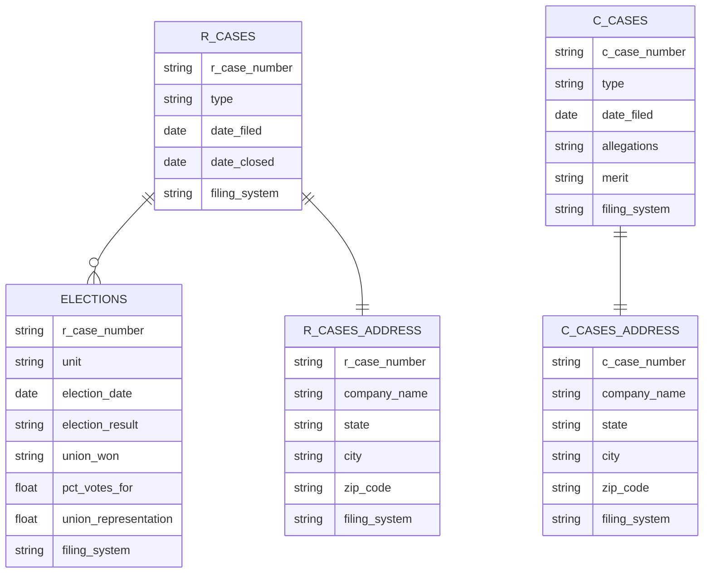

# NLRB Tables Schema

This diagram shows the database schema for NLRB R Cases and C Cases, consolidated from three filing systems: NxGen, CATS, and CHIPS.

## Entity Relationship Diagram

## Relationships

- **R_CASES to ELECTIONS**: One-to-many (one R case can have multiple elections in different units)
- **R_CASES to R_CASES_ADDRESS**: One-to-one (each R case has one address record)
- **C_CASES to C_CASES_ADDRESS**: One-to-one (each C case has one address record)

## Key Fields

- R-related tables are linked via the `r_case_number` field
- C-related tables are linked via the `c_case_number` field
