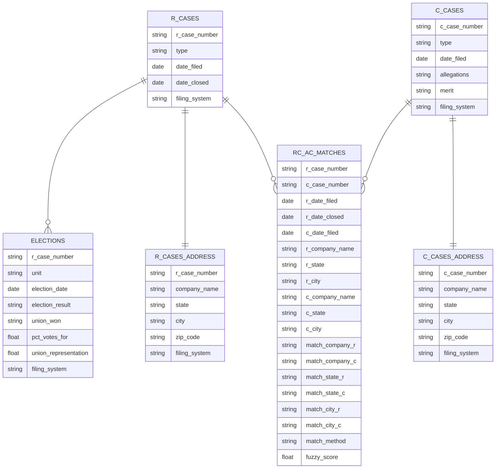

# NLRB Tables Schema

This diagram shows the database schema for NLRB R Cases and C Cases, consolidated from three filing systems: NxGen, CATS, and CHIPS.

## Entity Relationship Diagram

## Relationships

- **R_CASES to ELECTIONS**: One-to-many (one R case can have multiple elections in different units)
- **R_CASES to R_CASES_ADDRESS**: One-to-one (each R case has one address record)
- **C_CASES to C_CASES_ADDRESS**: One-to-one (each C case has one address record)
- **R_CASES to RC_AC_MATCHES**: One-to-many (each RC petition may match zero or more CA charges)
- **C_CASES to RC_AC_MATCHES**: One-to-many (each CA charge may match zero or more RC petitions)

## Key Fields

- R-related tables are linked via the `r_case_number` field
- C-related tables are linked via the `c_case_number` field
- `RC_AC_MATCHES` is a bridge table resolving the many-to-many link between RC petitions and CA charges filed during the petition's active window at the same establishment

## RC_AC_MATCHES Table Notes

Produced by `match_r_to_c_cases.py`, which runs in two modes (controlled by `--company-column`) and writes the same schema in both:

- **Fuzzy matching** (default): writes to `rc_ac_matches.parquet` / `rc_ac_matches.csv`.
- **Cluster-based matching** (`--company-column cluster_representative`): writes to `rc_ac_cluster_matches_20260517.parquet` / `.csv` (the date suffix matches the `cluster_assignments_20260517.csv` file consumed).

Schema notes:
- `r_*` / `c_*` columns carry the original company and location values from each side.
- `match_company_*`, `match_state_*`, `match_city_*` are the preprocessed/normalized forms that were actually compared.
- `match_method` indicates how the pair was linked: `exact` or `fuzzy`. (In cluster-based runs, all matches are `exact` because the cluster-representative substitution does the equivalence work upstream.)
- `fuzzy_score` is the `rapidfuzz.token_sort_ratio` score on company names for fuzzy pairs; `100.0` for exact matches.
