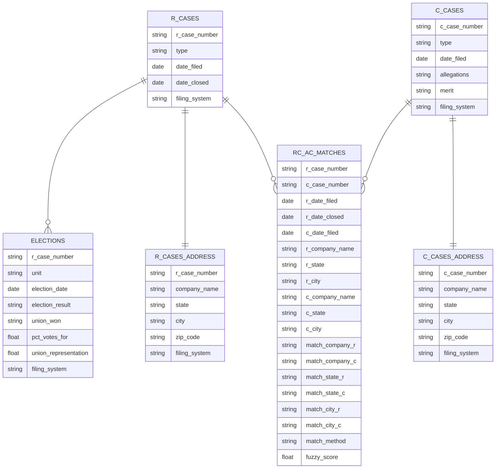

# NLRB Tables Schema

This diagram shows the database schema for NLRB R Cases and C Cases, consolidated from three filing systems: NxGen, CATS, and CHIPS.

## Entity Relationship Diagram

## Relationships

- **R_CASES to ELECTIONS**: One-to-many (one R case can have multiple elections in different units)
- **R_CASES to R_CASES_ADDRESS**: One-to-one (each R case has one address record)
- **C_CASES to C_CASES_ADDRESS**: One-to-one (each C case has one address record)
- **R_CASES to RC_AC_MATCHES**: One-to-many (each RC petition may match zero or more CA charges)
- **C_CASES to RC_AC_MATCHES**: One-to-many (each CA charge may match zero or more RC petitions)

## Key Fields

- R-related tables are linked via the `r_case_number` field
- C-related tables are linked via the `c_case_number` field
- `RC_AC_MATCHES` is a bridge table resolving the many-to-many link between RC petitions and CA charges filed during the petition's active window at the same establishment

## How the Matching Works

The goal is to link each union election petition (**R Case**) to the unfair-labor-practice charges (**C Cases**) that involve the **same workplace at the same time**. The script builds the final `RC_AC_MATCHES` table in three steps:

1. **Pair up candidates (merge).** Bring together R Cases and C Cases that share the same **company name**, **state**, and **NLRB region**. This creates a list of possible matches.
2. **Keep only the same place (filter).** From those candidates, keep the pairs whose **city** also matches.
3. **Keep only the same time (filter).** Keep the pairs where the charge (C Case) was filed **while the petition (R Case) was active** — that is, between the petition's filing date and its closing date.

What remains is the **final matches table**: one row per linked R Case–C Case pair, recording both cases and how they were matched.

### Handling inconsistent spelling

The same workplace is often written differently across the data — abbreviations, punctuation, spacing, and spelling vary from one record to the next. If we required text to match *exactly*, we would miss many true matches. To avoid this, both **company names** and **city names** are compared using **fuzzy matching**, which measures how *similar* two pieces of text are and accepts them as the same when they are close enough.

- **Company names.** Names are compared in two ways. An *exact* comparison catches names that are identical after a standardized cleanup. A *fuzzy* comparison then catches names that are highly similar but not identical — for example, "Acme Steel Corp" vs. "Acme Steel Co", or the same words in a different order. Only pairs whose similarity is above a set level are kept. The `match_method` column records whether each pair was linked by the exact or the fuzzy comparison.
- **City names.** The city check (step 2) works the same way: a pair is kept if the two cities are identical *or* close enough — for example, "St. Louis" vs. "Saint Louis". This allows minor variations through while still rejecting genuinely different cities.

## RC_AC_MATCHES Table Notes

The matching table is produced by `match_r_to_c_cases.py`, which can identify the same company in two ways (controlled by `--company-column`) and writes the same schema in both:

- **Fuzzy matching** (default): the name-based process described above — exact and fuzzy comparison of company names. Writes to `rc_ac_matches.parquet` / `rc_ac_matches.csv`.
- **Cluster-based matching** (`--company-column cluster_representative`): name variants are grouped into the same company in advance (via LLM-based clustering), so the matching itself only needs an exact comparison. Writes to `rc_ac_cluster_matches_20260517.parquet` / `.csv` (the date suffix matches the `cluster_assignments_20260517.csv` file consumed).

Column notes:
- `r_*` / `c_*` columns carry the original company and location values from each side.
- `match_company_*`, `match_state_*`, `match_city_*` are the cleaned-up (standardized) forms that were actually compared.
- `match_method` indicates how the pair was linked: `exact` or `fuzzy`. (In cluster-based runs, all matches are `exact` because the clustering does the name-grouping work upstream.)
- `fuzzy_score` is the company-name similarity score (`rapidfuzz.token_sort_ratio`) for fuzzy pairs; `100.0` for exact matches.
